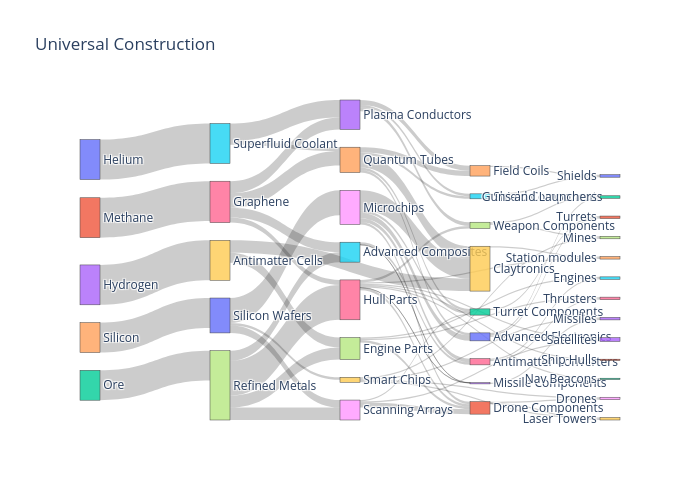
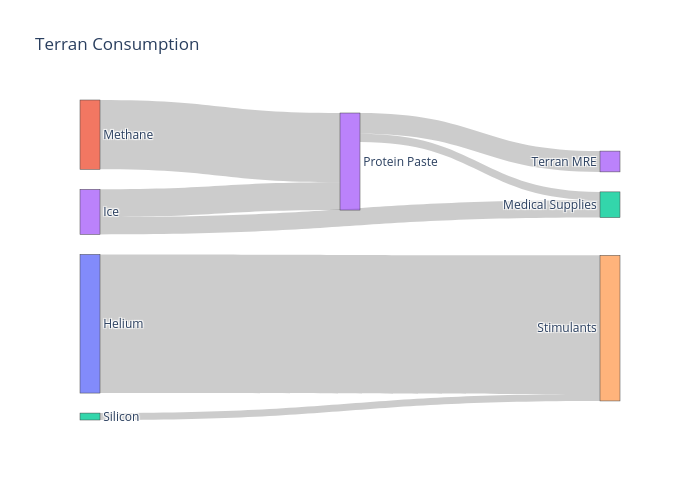
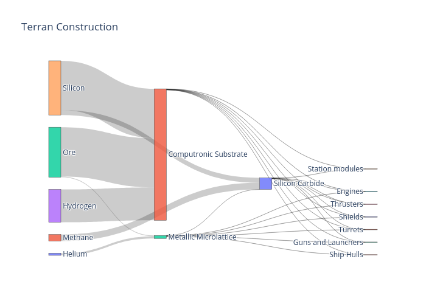
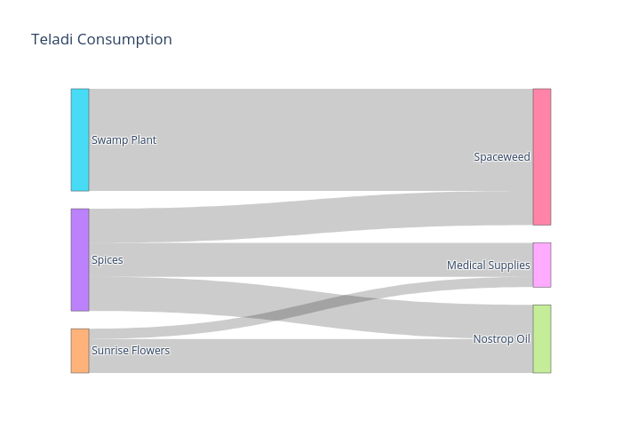
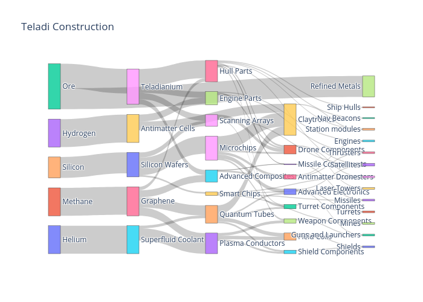
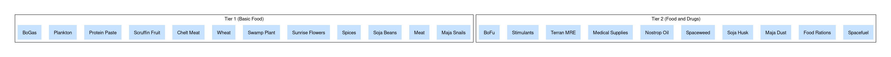
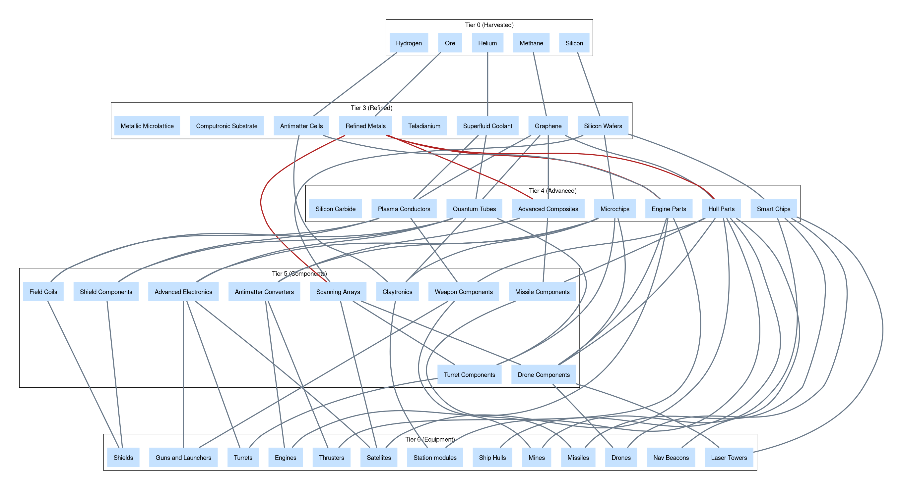
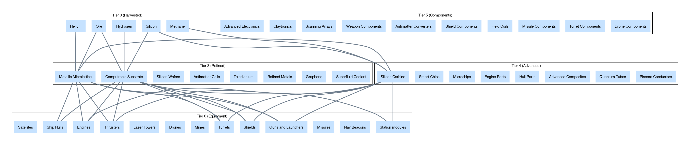
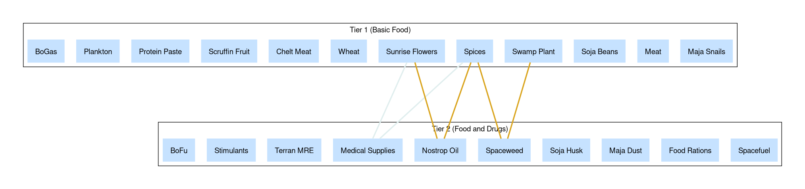
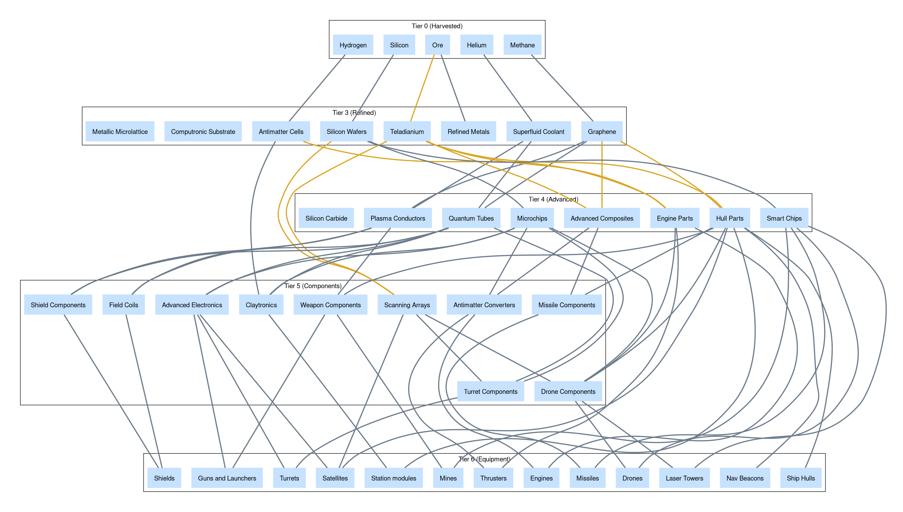

x4-diagrams
===========

Diagrams illustrating [X4] faction relationships and economy flows.

## Sankey diagrams








## Graphs








Usage
-----

```shell
python -m x4 --help
python -m x4.factions
python -m x4.economy
```

Graphviz `dot` files will be written to an `output/` directory.

References
----------

* https://wiki.egosoft.com:1337/X4%20Foundations%20Wiki/Manual%20and%20Guides/Objects%20in%20the%20Game%20Universe/Economy%20Flow%20Charts/
* https://x4prodchart.com/
* https://steamcommunity.com/sharedfiles/filedetails/?id=1585211529
* https://roguey.co.uk/x4/wares/
* http://www.x4-game.com
  * https://github.com/crissian/x4/blob/dev/src/app/shared/services/data/wares-data.ts

[X4]: https://store.steampowered.com/app/392160/X4_Foundations/
